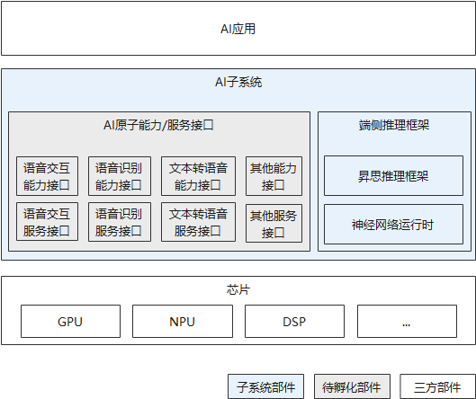

# sig_AI_Framework

简体中文 | [English](./sig_ai_framework.md)

说明：本SIG的内容遵循OpenHarmony的PMC管理章程 [README](/zh/pmc.md)中描述的约定。

## SIG组工作目标和范围

### 工作目标

AI子系统是OpenHarmony上的关键子系统，提供端侧推理框架和AI原子能力/服务接口，推理框架南向高效整合硬件计算资源，北向对AI应用开发者屏蔽底层差异，统一推理接口；AI原子能力/服务接口内置了通用AI能力，为AI应用开发者提供开盒即用的AI能力。AI子系统整合AI技术栈，有效简化了AI应用的开发和维护流程。

### 工作范围

- AI原子能力/服务接口

AI原子能力/服务接口分为能力和服务接口，能力接口是对AI模型的封装，对AI应用开发者提供开盒即用的AI能力，简化AI应用开发的流程和门槛；服务接口支持用户或三方等能力提供者将自定义的AI能力服务化，以服务方式支持能力接口调用，使能AI应用开发者。

- 昇思推理框架

昇思推理框架（MindSpore）是一个极速、极智、极简的AI引擎，使能全场景智能应用，为用户提供端到端的解决方案，帮助用户使能AI能力。更多信息，请见[MindSpore官网](https://www.mindspore.cn/lite)。MindSpore不仅需要为用户提供基础的训练和推理服务；更重要的是，为了拓展生态，我们需要与广大开发者合作，协助他们贡献他们的代码上库。

- 神经网络运行时

神经网络运行时（Neural Network Runtime）是端侧推理框架和AI芯片之间的重要的桥梁，统一了AI推理的南北向接口，北向Native API为端侧推理框架提供统一的构图、编译、推理接口，南向开放HDI接口，支持广大的硬件厂商将AI芯片通过南向接口接入OpenHarmony，共同建造丰富的OpenHarmony AI南向生态。

- AI子系统架构

## SIG组成员

### Leader

- @ivss(https://gitee.com/ivss)
- @zhanghaibo5(https://gitee.com/zhanghaibo5)
- @silenchen(https://gitee.com/silenchen)

### Committers列表

- @zhaizhiqiang(https://gitee.com/zhaizhiqiang)
- @zhang_xue_tong(https://gitee.com/zhang_xue_tong)
- @HilbertDavid(https://gitee.com/HilbertDavid)
- @jpc_chenjianping(https://gitee.com/jpc_chenjianping)
- @yangyongjie-boom(https://gitee.com/yangyongjie-boom)
- @jianghui58(https://gitee.com/jianghui58)

### 会议
 - 会议时间：双周例会，周一晚上19：00, UTC+8
 - 会议链接：请[订阅](https://lists.openatom.io/postorius/lists/dev.openharmony.io)邮件列表 dev@openharmony.io 获取会议链接

### 联系方式(可选)

- 邮件列表：xxx
- 微信群：xxx
