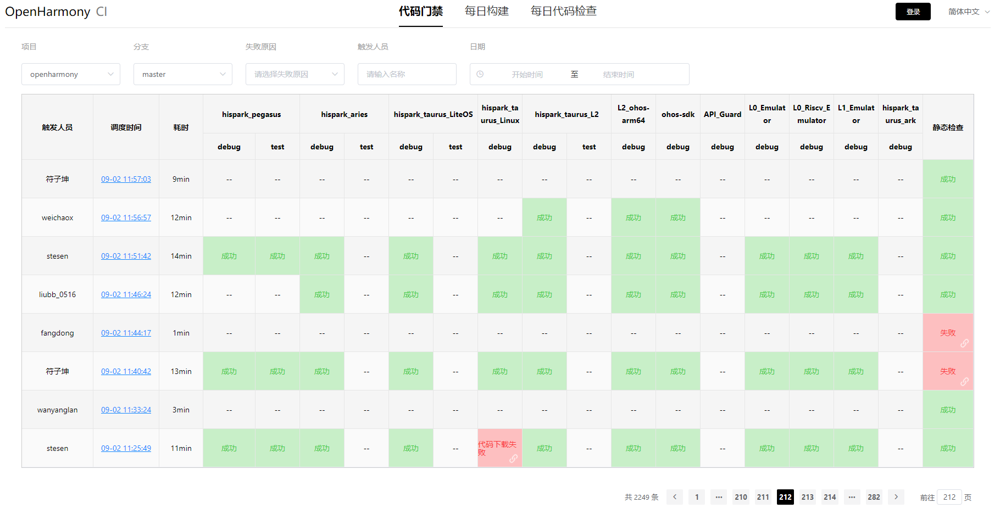
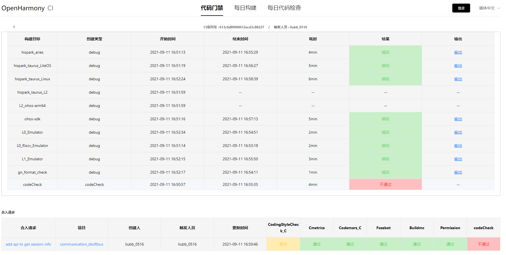
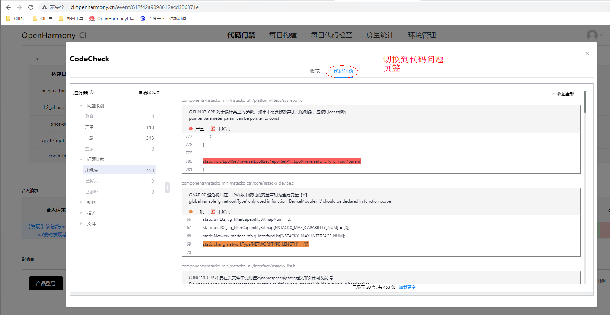
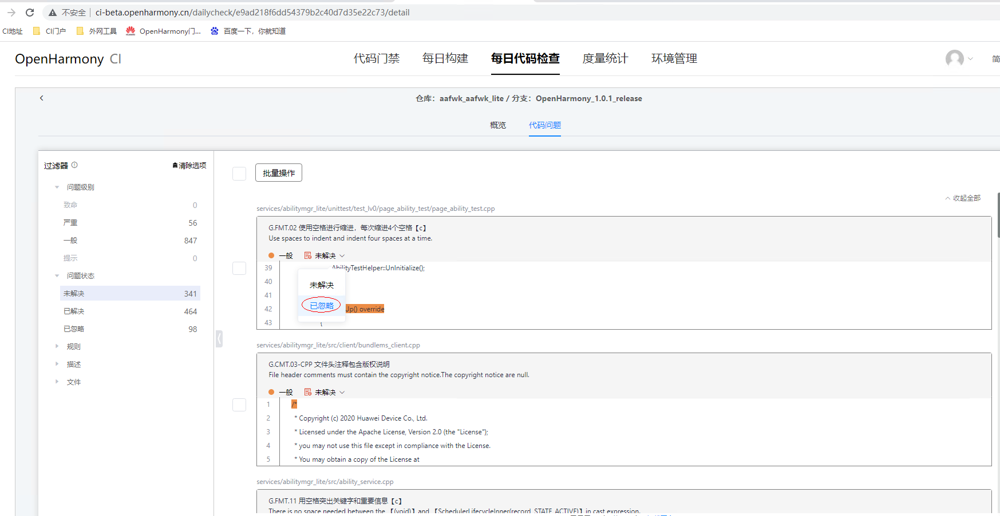

# OpenHarmony代码门禁质量要求、活动定义及实践介绍

**代码门禁的使用场景**：当开发者完成一个issue（Feature、Task、Bug），准备提交PR合入开源主干，在代码合入主干前，会触发代码检视、代码门禁流水线，其中代码门禁负责检查待合入PR新增或者修改的所有文件是否达到质量要求。达到质量要求才允许合入开源主干；否则该PR需要开发者修订检查出来的问题，继续重复提交PR动作。

注意：代码门禁的触发以issue为单位，支持一个Issue下面挂多个PR的情况，原因是研发中存在一个Issue单需要多人联合开发场景，或者说多个PR存在关联关系，为了避免代码门禁的重复构建或者PR间的相互依赖，需要以Issue为单位多PR提交后，再触发代码门禁执行。

## 代码门禁活动定义

**代码门禁的活动定义及实践**

代码门禁活动主要分为流水线触发（码云触发流水线执行：webhook模式）、代码下载、构建、部署、测试几个步骤，如下图所示。

图-1：代码门禁的主要活动和实践

其中主要的检查项包含：编译检查、静态/安全/开源检查、敏感词/copyright扫描、部署、冒烟测试、功能测试。由于OpenHarmony涉及多型号开发板验证，为了提升门禁执行效率，基于提交PR识别精准构建和精准测试。

门禁检查结果可以通过码云提交PR的评论区查看（参考图-2）或者直接访问[http://ci.openharmony.cn](http://ci.openharmony.cn)查看结果（参考图-3）。

图-2：在码云评论区可以直接查看代码门禁执行结果																							

可以直接访问[http://ci.openharmony.cn](Http://ci.openharmony.cn) ，查看代码门禁、每日版本构建的详细情况。可点击每笔记录，查看详情。

图-3：OpenHarmony的Ci门户网站

## 代码门禁的质量要求：包含检查项、规范、及操作指南
代码门禁的质量要求：涉及的PR提交代码等文件必须通过各项检查，才允许代码合入主干。
当前门禁检查项包含：编译告警（涉及多型号开发板及模拟器）、构建规范检查（OpenHarmony构建规范）、CodeCheck（静态/安全/开源检查、敏感词/copyright扫描）、部署（烧录）、测试（冒烟测试和功能测试）4个部分，下面具体来说明每个部分的检查项及要求。

### 编译告警 

    编译告警主要用于检查代码下载是否Ready(基线代码下载、PR代码获取)、编译环境是否Ready（prebuilts编译依赖工具、lfs二进制工具、node_modules、nodejs、build/lite等）、编译是否通过（全量编译、增量编译、缓存是否OK）、编译选项检查是否最优；
    编译选项检查主要是针对C/C++语言编译选项或系统配置的检查，检查规范涉及语言选项、警告选项、安全选项、总体选项、代码生成选项、架构选项、优化选项、编译宏等。

参考 [OpenHarmony编译规范](编译规范.md)

### 构建规范检查 

为指导OpenHarmony的社区开发者开展构建工作，提升构建系统的可重复性、可维护性，提高构建质量，构建规范工作组分析总结了各种典型的构建问题，提炼相应的构建规则和建议，制订了规范，用于保障构建脚本的存放目录、文件格式、编写内容符合要求。 

具体规范参考《OpenHarmony构建规范 》

### CodeCheck检查 & 屏蔽

#### CodeCheck检查
CodeCheck支持静态扫描、安全扫描、代码度量、开源合规、敏感词扫描、Copyright等检查服务。对于检测问题存在争议，需要和Committer确认，是否为问题或者工具告警在当前代码上下文为非问题。Committer确认问题不用修改，可直接在Ci门户网站登录，系统会提供屏蔽功能，允许Committer屏蔽该问题，以保障该问题不再重复检测出现。

#####  工具及服务使用
CI门户：选择任意一个PR的CodeCheck检查结果（包括“通过”、“不通过”、“失败”，若结果为“失败”表示未获取到扫描结果，即不支持查看），进入到代码检查结果查看页面。具体如下。
1、选择任意一个代码门禁CI流水线执行记录，进入详情查看页面。

2、点击CodeCheck检查结果，例如：”不通过“，进入代码检查详情页面。

说明：从Gitee码云选择提交的PR（对应仓库下的Pull Requests），或从CI门户上选择任意一个PR进入详情后点击合入请求即跳转Gitee码云对应的PR，根据评论中start build的时间找到对应的合入记录，即可查看CodeCheck检查返回的结果。具体如下。

1、选择任意一个PR的合入请求即可跳转码云对应的PR，如下
Gitee码云入口：

CI门户入口：

2、根据评论中start build的时间找到对应的合入记录，即可查看CodeCheck检查返回的结果。

##### 静态扫描 
支持通用&安全编程规范集成；支持C/C++、JS、Java。
具体规则参考 [OpenHarmony 通用编码规范](https://gitee.com/openharmony/docs/blob/master/zh-cn/contribute/%E8%B4%A1%E7%8C%AE%E4%BB%A3%E7%A0%81.md) 

##### 安全扫描
支持C/C++、JS、Java语言安全编程规范的检查。
具体规则参考[OpenHarmony 安全编码规范](https://gitee.com/openharmony/docs/blob/master/zh-cn/contribute/%E8%B4%A1%E7%8C%AE%E4%BB%A3%E7%A0%81.md) 

##### 代码度量
支持单仓代码检查；支持代码行、重复率、重复文件数、函数数、圈复杂度总数统计和展示。

##### 开源及第三方
支持开源及第三方软件的源码文件、二进制文件扫描，提供风险扫描及评估能力。

##### 敏感词扫描
支持配置敏感词清单，输出文件名、路径名、文件内容中的敏感词扫描结果。

##### Copyright
支持基于文件夹、文件名、文件后缀配置Copyright规则，规则可以配置Copyright类型和逻辑。

#### 屏蔽指导
屏蔽操作主要针对一般以及上问题级别，未登录或者非代码仓的committer用户无操作权限。当前的主要规则如下(黄区网络暂时无法屏蔽代码问题)：

1. 未解决问题可以修改为已忽略问题。
2. 已忽略问题可以修改为未解决问题。
3. 未解决问题和已忽略问题都无法修改已解决问题。

#####  单个问题状态修改
根据过滤器查看结果，选择问题，下拉菜单点击"已忽略"即可。

#####  批量操作问题修改
选择要修改的问题后点击 "批量操作"，设置修改后的问题状态为"已忽略"，然后“确认”即可。

## 部署升级及测试
门禁流水线测试涉及的测试活动主要有部署升级、冒烟测试、功能测试、API看护测试。精准测试是对功能测试及API看护测试用例挑选后的精确测试，具体如下： 

#### 冒烟测试

冒烟测试是在软件开发过程中的一种针对软件版本包的快速基本功能验证策略，是对软件基本功能进行确认验证的手段，并非对软件版本包的深入测试。冒烟测试的对象是每一个新编译的需要正式测试的软件版本，关注的是阻塞型缺陷。
门禁冒烟测试用例是选择功能测试用例中level 0的用例，主要保障版本可以正常开关机，主功能可用，覆盖多种设备形态。

#### 功能测试
功能测试是对产品的各功能模块进行验证，包含全量测试用例中level 0~5的用例。根据功能用例覆盖结果，测试产品是否达到各模块功能的质量要求。

#### API看护测试 
根据代码仓与api头文件的关联关系，通过识别所提交的代码对代码仓头文件的修改，触发对应形态下自身代码仓的XTS用例的执行。

#### 优化：精准构建&精准测试
根据代码仓与设备形态之间的关联关系，通过识别所提交的代码对代码仓文件的修改，触发对应形态下所修改的代码仓的TDD level0用例的执行。

#### 代码门禁测试用例上线规则

##### 门禁问题提单
门禁用例问题第一时间转给第一责任人，经分析后，由第一责任人继续往下分解。

##### 门禁响应时间
TDD 用例上线门禁后，定位出用例导致的测试失败，需要两小时内闭环。

##### 门禁用例下线
用例问题两小时未解决的，需对应的责任田即时下线，不影响后续的门禁。

##### 门禁用例上线
1. 用例重新上线或者新用例上线，需要责任人提供两天以上的稳定报告并知会我们（门禁看护人）。
2. 流水线这边压测48小时后才可重新上线。